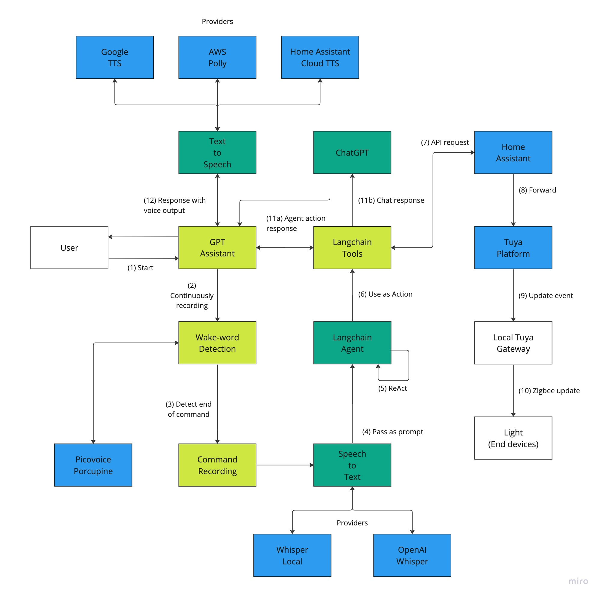

# Atom the GPT Assistant - Smart Home Powered with AI

### Features

-   Always-ON conversational assistant with [ChatGPT](https://openai.com/blog/chatgpt)
-   Continuous recording with wake-word (using [Porcupine](https://picovoice.ai/platform/porcupine/) by Picovoice), you can configure the way you ask your assistant (`Hey Atom` by default)
-   Interacts with your home devices (via [Home Assistant](home-assistant.io)), say toggling a light or TV at home
-   Reading the status of sensors (like actual temperature and humidity of your home)
-   Context-aware conversation based on in-memory history
-   Configurable Speech-to-Text and Text-to-Speech providers (OpenAI Whisper, AWS Polly, Google TTS, Home Assistant Cloud, etc)

## Installation

GPT Assistant uses [Poetry](https://python-poetry.org/) to manage dependencies

To install required packages, run

```bash
$ poetry install
```

## Configuration

Copy the `.env.example` into `.env` and then setup the environment variables, here is the list of supported variables:

| Variable                   | Required | Default                         | Description                                                                                                              |
| -------------------------- | -------- | ------------------------------- | ------------------------------------------------------------------------------------------------------------------------ |
| `HOME_ASSISTANT_URL`       | True     | -                               | The endpoint of Home Assistant, e.g. http://127.0.0.1:8123                                                               |
| `HOME_ASSISTANT_API_TOKEN` | True     | -                               | JWT token obtained from Home Assistant                                                                                   |
| `STT_PROVIDER`             | False    | `openai`                        | The provider for speech-to-text                                                                                          |
| `TTS_PROVIDER`             | False    | `google_tts`                    | The provider for text-to-speech                                                                                          |
| `OPENAI_API_KEY`           | True     | -                               | The API key of [OpenAI](https://platform.openai.com/account/api-keys) for ChatGPT and Whisper                            |
| `OPENAI_WHISPER_LANGUAGE`  | False    | `en`                            | The language used for Whisper transcription                                                                              |
| `OPENAI_CHAT_MODEL`        | False    | `gpt-3.5-turbo`                 | The model used for ChatGPT conversation                                                                                  |
| `PORCUPINE_ACCESS_KEY`     | True     | -                               | The access key used for [Picovoice](https://console.picovoice.ai/) wake-word detection                                   |
| `PORCUPINE_KEYWORD_PATH`   | False    | `./picovoice/hey_atom.ppn`      | The trained model for wake-word, default as "Hey Atom". You might train your own in Picovoice and change it with the ENV |
| `WHISPER_CMD_OPTIONS`      | False    | `--model tiny.en --language en` | Used when you use Whisper local command                                                                                  |
| `AWS_REGION`               | False    | -                               | For AWS Polly, example: `ap-southeast-1`                                                                                 |
| `AWS_ACCESS_KEY_ID`        | False    | -                               | For AWS Polly                                                                                                            |
| `AWS_SECRET_ACCESS_KEY`    | False    | -                               | For AWS Polly                                                                                                            |
| `AWS_POLLY_VOICE_ID`       | False    | -                               | For AWS Polly, example: `Ruth`                                                                                           |
| `AWS_POLLY_LANGUAGE_CODE`  | False    | -                               | For AWS Polly, example: `en-US`                                                                                          |
| `AWS_POLLY_ENGINE`         | False    | -                               | For AWS Polly, example: `neural`                                                                                         |

Noted that you will also need to setup devices in Home Assistant and enable [REST API](https://developers.home-assistant.io/docs/api/rest)

## Usage

### Continuous Mode

Start GPT Assistant with continuous mode, it will wait for the wake-word and following the voice command and execute your order.

```bash
$ make run
```

It might take a minute for the first run, then you will see the messages below when it's up

```
GPT Assistant is running (press Ctrl+C to exit)
Waiting for wake word...
```

Now you can talk say "Hey Atom" to wake up the assistant and then talk with it

### API Mode

In case of debugging or advanced usage, GPT Assistant can be run in API mode. You might trigger it with HTTP request by running

```bash
$ make run_api
```

Sample request

```
curl -X POST -H "Content-type: application/json" 127.0.0.1:8000/v1/commands -d '{"text": "Turn off the TV"}'
```

Response

```
{"response": "Sorry, I cannot find the device tv"}
```

Use cases:
- Integrate with [Whatsapp](https://github.com/askrella/whatsapp-chatgpt)
- Works with [Shortcut](https://support.apple.com/en-gb/guide/shortcuts/welcome/ios)
- Cron trigger
- You name it

## Architecture

My home is running some smart devices like lightbulbs, outlets with an IoT platform called "Tuya". GPT Assistant will work with Home Assistant API and interacts with the Tuya platform with push notification to update state of the physical devices.

Recorded command will be processed and pass into langchain with some pre-defined tools for

- Discovery devices at home
- Toggle a devices
- Read and response with the current state of device

Future

- Trigger scenes
- Support more device types

For general conversation and Q&A, it will pass the prompt to ChatGPT. Message history is now stored in memory, you might ask GPT Assistant to "reset the context".



## Demo

https://youtu.be/n3DuSEO3foo

## Disclaimer

Use at your own risk, if you have any trouble, don't hesitate to contact me. Also You might be charged for usage on

- OpenAI (ChatGPT and Whisper)
- Porcupine (Free-tier can support up to 3 users per month)
- AWS Polly (Free-tier includes 1 million characters per month)

## Contributing

Bug reports and pull requests are welcome on GitHub at https://github.com/Seitk/gpt-assistant

## License

The package is available as open source under the terms of the [MIT License](http://opensource.org/licenses/MIT).
